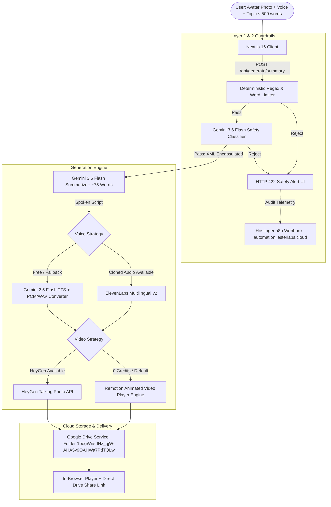

# Edu-Avatar: AI-Powered Educational Video Generation Engine

> **Live AI Enablement Showcase**: Accessible on Nathan Lester's portfolio at [https://winelogbooks.com/projects](https://winelogbooks.com/projects)  
> **Source Repository**: [https://github.com/N8Space/edu-avatar.git](https://github.com/N8Space/edu-avatar.git)

Edu-Avatar is an enterprise-grade, cost-engineered AI video platform that transforms raw educational knowledge articles (≤ 500 words) into engaging **30-second personalized talking avatar videos**. 

The system was architected to demonstrate **AI Enablement Leadership**, **OWASP LLM Defensive Guardrails**, and **Graceful Tiered Fallbacks** across modern hybrid infrastructure (Hostinger VPS + Google Cloud Platform + GitHub Actions CI/CD).

---

## Architecture Overview



---

## Key Architectural & Engineering Highlights

### 1. Zero-Cost & Pay-As-You-Go Resilience
- **Zero Azure Dependency**: Eliminates vendor lock-in by executing purely on Hostinger VPS and Google Cloud Platform.
- **Gemini 2.5 Flash TTS Fallback**: High-definition voice synthesis fallback when ElevenLabs free-tier quotas are exhausted, utilizing an in-memory 44-byte RIFF WAV generator from raw PCM chunks ($0.00 audio generation).
- **Remotion Dynamic Player**: Guarantees video delivery even when HeyGen quotas reach zero credits, providing immediate synchronized audio visualization, animated user avatar, and subtitle overlay without external rendering charges.

### 2. Multi-Layer AI Guardrails (OWASP Top 10 for LLMs)
- **Layer 1: Deterministic Pre-Filtering**: Validates strict word-count limits (≤ 500 words) and immediately catches direct prompt overrides, DAN jailbreaks, instruction tampering, and system prompt leaks.
- **Layer 2: Structured Safety Classifier**: Uses Gemini 3.6 Flash configured with JSON Schema mode to classify inputs across prompt injection, hate speech, harassment, violence, sexual content, and malicious impersonation.
- **Strict XML Boundary Encapsulation**: Isolates all user knowledge content in `<user_article>` XML tags with instruction suppression rules.
- **Security Audit Telemetry**: Asynchronously streams security violation logs to the user's Hostinger VPS n8n orchestration node (`https://automation.lesterlabs.cloud`).

### 3. Automated Google Drive Archiving
- Automatically saves generated audio and video assets directly into Google Drive folder `1bogWnsdHz_qjW-AHA5y9QAHWa7PdTQLw` via Service Account authentication.
- Returns a shareable `webViewLink` directly to the user interface.

### 4. Containerized Hostinger VPS & CI/CD Pipeline
- Fully dockerized Next.js standalone container (`Dockerfile` and `docker-compose.yml`).
- Automated `.github/workflows/ci-cd.yml` pipeline with:
  - Automated linting (`eslint`), TypeScript compilation (`tsc --noEmit`), and production build.
  - SSH deployment to Hostinger VPS with containerized rebuild and `/api/health` validation.

---

## Quick Start (Local Development)

### 1. Prerequisites
- Node.js 20+
- A Google Gemini API key from [Google AI Studio](https://aistudio.google.com/apikey)
- (Optional) ElevenLabs API Key & HeyGen API Key for SaaS voice cloning and talking photos

### 2. Installation
```bash
git clone https://github.com/N8Space/edu-avatar.git
cd edu-avatar
npm install
```

### 3. Environment Configuration
Create a `.env.local` file:
```env
# Required for Summarization, Guardrails, and Free Voice Synthesis
GOOGLE_API_KEY=your_gemini_api_key

# Optional: Commercial Voice Cloning (Falls back to Gemini TTS if omitted/exhausted)
ELEVENLABS_API_KEY=your_elevenlabs_key

# Optional: Commercial Avatar Video (Falls back to Remotion Engine if omitted/exhausted)
HEYGEN_API_KEY=your_heygen_key

# Google Drive Storage Folder
GOOGLE_DRIVE_FOLDER_ID=1bogWnsdHz_qjW-AHA5y9QAHWa7PdTQLw
```

Ensure `service_account_key.json` or `GOOGLE_SERVICE_ACCOUNT_JSON` is configured for Google Drive archiving.

### 4. Run Development Server
```bash
npm run dev
```
Open [http://localhost:3000](http://localhost:3000) to view the application.

---

## Health Check & Monitoring
Inspect the production container health at:
```
GET /api/health
```
Response:
```json
{
  "status": "healthy",
  "service": "edu-avatar",
  "version": "1.0.0",
  "timestamp": "2026-09-04T03:00:00.000Z",
  "uptime_seconds": 124,
  "integrations": {
    "gemini_flash": true,
    "elevenlabs": true,
    "heygen": true,
    "n8n_automation_node": "https://automation.lesterlabs.cloud",
    "google_drive_folder": "1bogWnsdHz_qjW-AHA5y9QAHWa7PdTQLw"
  }
}
```

---

## Author & Showcase
Developed by **Nathan Lester** — AI Enablement Lead  
Portfolio & Projects: [https://winelogbooks.com/projects](https://winelogbooks.com/projects)
